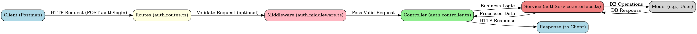

# blog-backend-application

Blog api project

## Feature-based Modular Architecture

## project setup



```bash
root/
├── auth-logs/              # Directory for storing authentication logs.
├── dev/                    # Development-related files (optional setup or configurations).
├── docs/                   # Documentation files for the project.
├── logs/                   # General log files for the application.
├── node_modules/           # Node.js modules installed via npm.
├── public/                 # Static files (e.g., images, CSS, JavaScript for the frontend).
├── src/                    # Main source code of the application.
│   ├── config/             # Configuration files (e.g., environment variables, app settings).
│   ├── features/           # Application features, organized by modules.
│   │   ├── auth/           # Authentication module.
│   │   │   ├── controllers/
│   │   │   │   ├── accountRecovery.controller.ts   # Controller for handling account recovery logic.
│   │   │   │   ├── auth.controller.ts             # Controller for authentication logic (e.g., login, signup).
│   │   │   ├── dtos/                              # Data transfer objects for request/response validation.
│   │   │   ├── emails/                            # Email templates for authentication-related emails.
│   │   │   ├── interfaces/                        # TypeScript interfaces for the auth module.
│   │   │   │   ├── authController.interface.ts    # Interfaces for the auth controller.
│   │   │   │   ├── authService.interface.ts       # Interfaces for the auth service.
│   │   │   ├── middlewares/                       # Middleware for authentication (e.g., authorization checks).
│   │   │   │   ├── auth.middleware.ts            # Middleware for validating authentication requests.
│   │   │   ├── models/                            # Database models related to authentication.
│   │   │   ├── routes/                            # Routes for authentication endpoints.
│   │   │   ├── services/                          # Business logic for authentication.
│   │   │   ├── tests/                             # Unit and integration tests for the auth module.
│   ├── jobs/                 # Scheduled tasks or background jobs (e.g., cleanup, cron jobs).
│   ├── logging/              # Logging utilities for the application.
│   ├── shared/               # Shared utilities or modules used across the app.
│   ├── types/                # TypeScript type definitions for global use.
│   ├── utils/                # Utility functions or helper methods.
│   ├── app.ts                # Main application entry point.
│   ├── index.ts              # Application bootstrap file.
├── .dockerignore            # Files and directories to ignore in Docker builds.
├── .env                     # Environment variables.
├── docker-compose.yml       # Docker Compose configuration.
├── Dockerfile               # Dockerfile for containerizing the application.
├── LICENSE                  # License for the project.
├── package.json             # Node.js dependencies and scripts.
├── package-lock.json        # Lock file for Node.js dependencies.
├── README.md                # Project overview and instructions.

```
